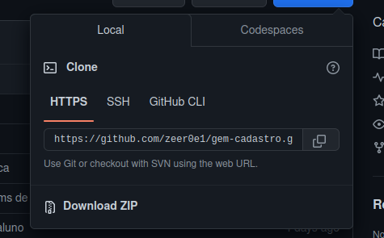
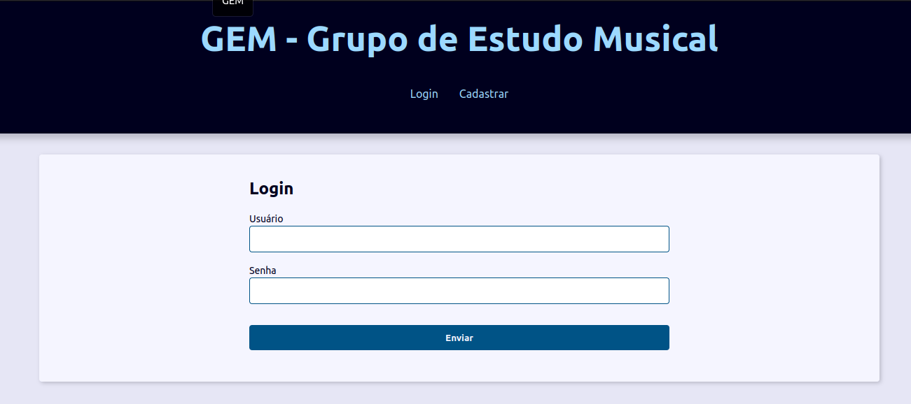
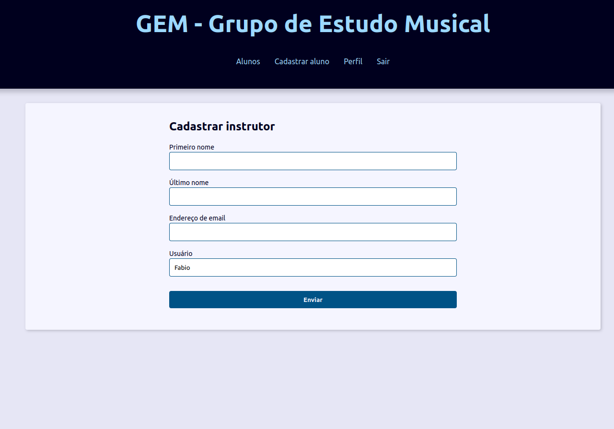
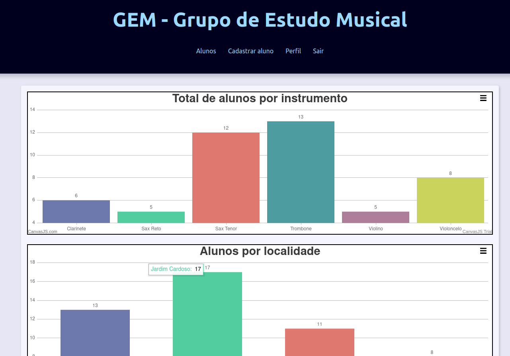
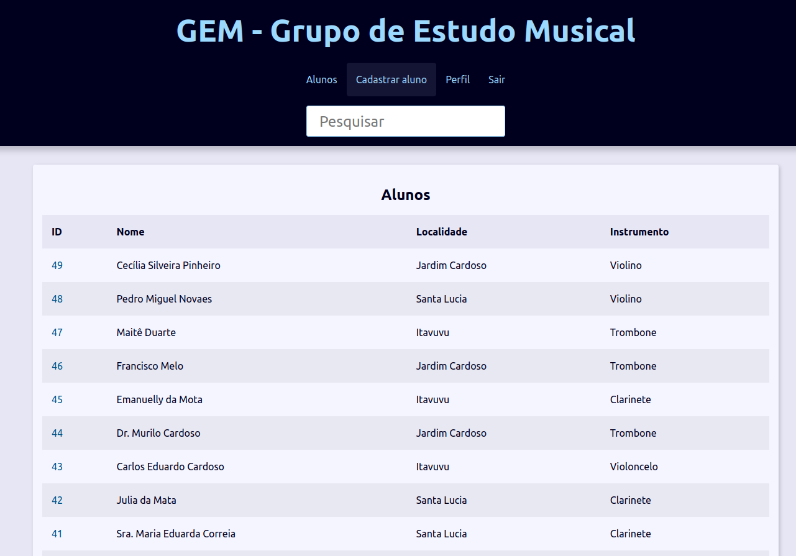
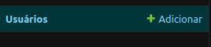
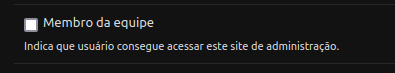

# gem-cadastro

Cadastro de alunos do GEM

## Descrição do projeto

Sistema criado para auxiliar no cadastro de alunos do grupo de estudo músical, que como o nome já diz é um grupo de estudos musicais onde alunos podem aprender a música voltada a música sacra utilizada na congregação cristã no Brasil.

## Como utilizar ?

O projeto foi realizado inicialmente para rodar localmente e para utilizar deve-se possuir um computador com a versão 3.10 do Python.

### Instalação

1.Após a instalação do python baixe/clone o repositório atráves do link 

2.Extraia os arquivos e navegue até a pasta e abra o terminal de sua preferencia e execute o seguinte comando:  

<code>python -m venv venv  </code>

Esse código vai criar o ambiente virtual onde vamos executar a aplicação.

3.inicialize o ambiente virtual  

<code> . /venv/bin/activate </code>

#### Instalando as dependencias do projeto
1.após inicializar o seu ambiente virtual instale as dependencias do projeto com o comando  

<code>pip install -r requiriments.txt </code>
> Esse comando pode variar dependendo do sistema operacional

### Iniciando a aplicação
Antes de iniciar aplicação podemos executar um script feito em python que vai criar alguns dados no banco de dados da aplicação, para executar esse script basta navegar até a pasta utils e executar o arquivo create_alunos  

<code> python create_alunos.py </code>  

Também devemos criar um usuário admin que vai servir para acessar a area administrativa do djang,para realizar esse cadastro basta executar o comando abaixo e seguir as instruções da tela:  

<code> python manger.py createsuperuser </code>  

após criar o usuário podemos estar iniciando a aplicação:  

<code> python manage.py runserver </code>
## Como utilizar
Ao iniciar a aplicação o usuário será direcionado para a tela de login:  

Podendo realizar um login caso já tenha um usuário ou criar um, caso o usuário não tenha um login ele pode clicar em Registar e realizar o cadastro:  

Após realizar o cadastro o usuário vai poder acessar a página principal onde contem os gráficos e a página de listagem de alunos: >br>

## Liberação de acesso 
Por questão de segurança algumas páginas da aplicação só podem ser acessadas após a liberação do usuário como membro da equipe, para realizar isso o usuário deve seguir o passo a passo abaixo:
1- Acessar a página admin do django pelo link:  

<code> http://127.0.0.1:8000/admin/ </code>
> para acessar a página deve-se utilizar o usuário criando no inicio da aplicação

2- Acessar a área administrativa e clicar na opções usuários:  

3- Selecionar o usuário e marcar a seleção onde está escrito "Membro da equipe":  

